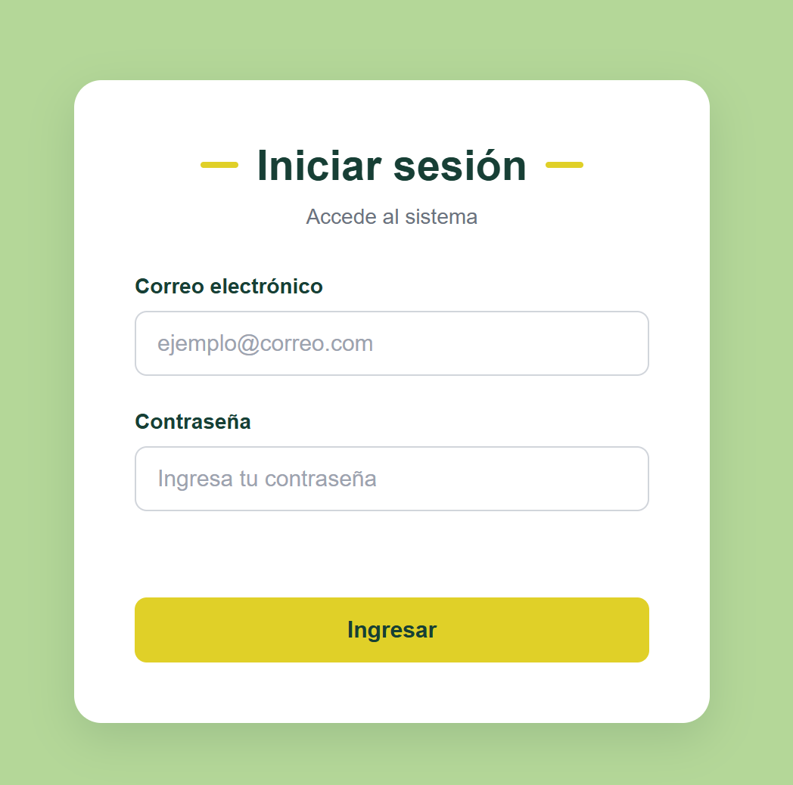
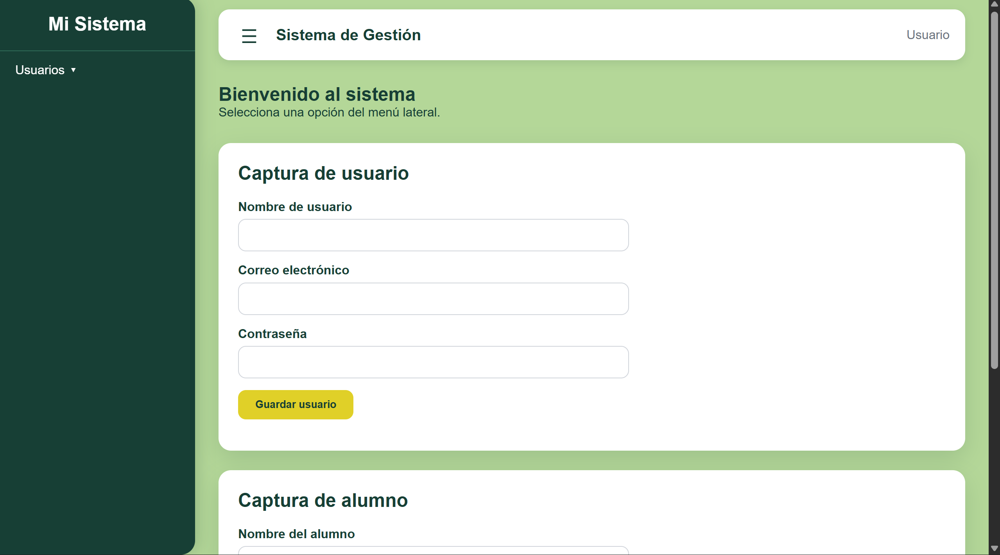
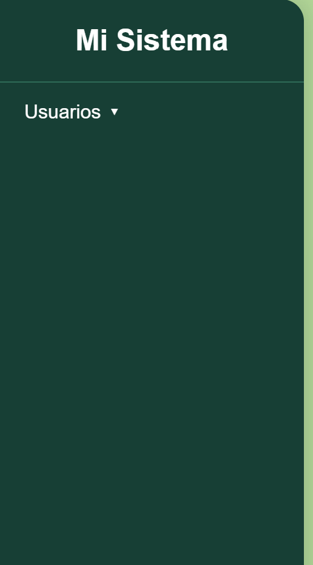
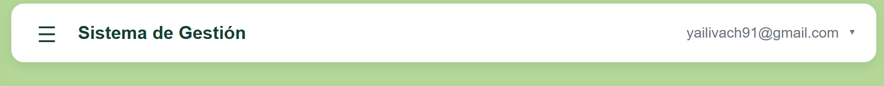
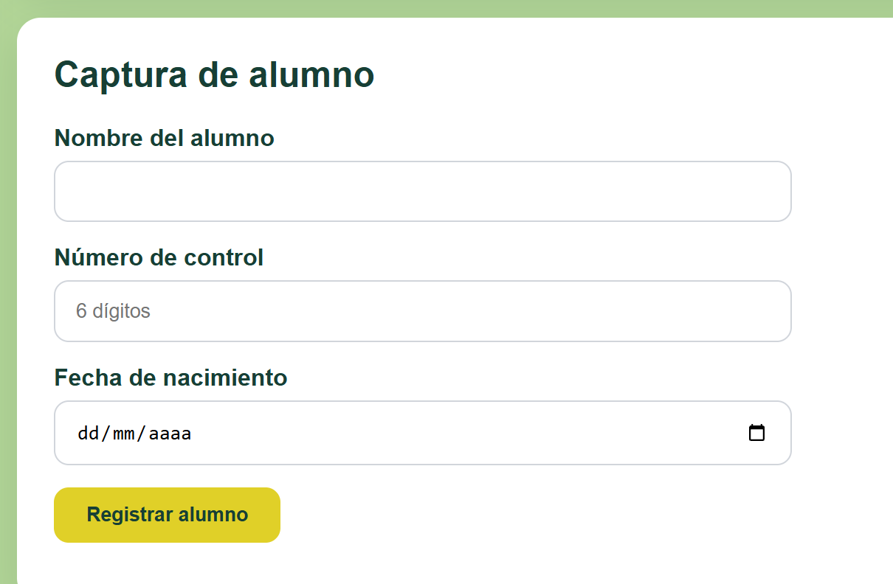
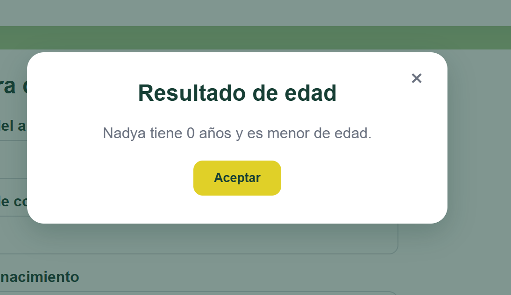

# Actividad 5 - Proyecto de Login

## Integrantes

- **López Cortés Hayley Brithany**
- **Avendaño Chavez Nadya Yahuili**

## Enlaces

- **Repositorio:** https://github.com/BriCortesTec/Actividad5-PW
- **GitHub Pages:** https://bricortestec.github.io/Actividad5-PW/login.html

---

## Descripción del proyecto

El proyecto consiste en desarrollar un sistema web con un **login funcional** utilizando HTML, CSS y JavaScript.

El usuario inicia sesión mediante un correo y una contraseña. Después de validar los datos, se accede a la pantalla principal del sistema, donde se encuentran el sidebar, navbar, formularios de usuarios y alumnos, además del modal para determinar la mayoría de edad.

**Login → Sistema → Formularios → Cerrar sesión → Login**




---

# Tecnologías utilizadas

- **HTML5**
- **CSS3**
- **JavaScript**
- **Git**
- **GitHub**
- **GitHub Pages**

### Framework CSS

Para este proyecto se utilizó **CSS3 sin un framework externo**, creando los estilos directamente en archivos CSS. Se definió una paleta de colores con variables CSS (`:root`) para mantener el mismo diseño en el login y en el sistema.

También se reutilizó la librería **`utileria.js`** desarrollada en la Actividad 2.

---

# Estructura del proyecto

```
Actividad5-PW/
├── README.md
├── login.html
├── index.html
├── css/
│   ├── index.css
│   └── login.css
├── js/
│   ├── index.js
│   ├── login.js
│   └── utileria.js
└── img/
    ├── alumno.png
    ├── edad.png
    ├── login.png
    ├── login2.png
    ├── navbar.png
    ├── sidebar.png
    └── sistema.png
```

---

# Flujo del Login

El funcionamiento del sistema comienza en `login.html`.

### Paso 1: Ingreso de datos

El usuario introduce:

- Correo electrónico
- Contraseña

### Paso 2: Validación

JavaScript verifica que el correo y la contraseña cumplan con los requisitos establecidos.

Se utilizan las funciones:

```js
validarCorreo()
validarPassword()
```

Si algún dato es incorrecto, se muestra un mensaje de error y el usuario no puede avanzar.

### Paso 3: Guardado de la sesión

Cuando los datos son válidos, el correo del usuario se guarda en el navegador para poder usarlo en la siguiente pantalla:

```js
sessionStorage.setItem("usuario", correo);
```

### Paso 4: Redirección

Después de guardar los datos, el sistema redirige al usuario a `index.html`:

```js
window.location.href = "index.html";
```

---

# Cómo se pasa el nombre de usuario del login al navbar

1. En `login.js` se guarda el correo en `sessionStorage` al validar el login.
2. En `index.html`, al cargar la página, se lee ese valor:

```js
const usuario = sessionStorage.getItem("usuario");
document.getElementById("nombreUsuario").textContent = usuario;
```

3. El nombre se muestra a la derecha del navbar.
4. Si no existe una sesión guardada, el sistema regresa automáticamente a `login.html`.

---

# Estructura del sistema (index.html)

### Sidebar

- Botón hamburguesa para abrir y cerrar el menú lateral.
- Opción **Usuarios** con submenú desplegable **Captura**.

### Navbar

- Muestra a la derecha el nombre del usuario que inició sesión.
- Al dar clic en el nombre se despliega un menú con la opción **Salir**, que elimina la sesión y regresa a `login.html`.

### Formulario de usuarios

Campos:

- Nombre de usuario
- Correo electrónico
- Contraseña

Validados con `validarCorreo()` y `validarPassword()`.

### Formulario de alumnos

Incluye el campo **número de control**, validado para que tenga exactamente **6 dígitos**.

### Modal de edad

Al capturar la edad del alumno, se muestra un modal que indica si es **mayor de edad** o **menor de edad**.

---

# Métodos principales

| Función | Archivo | Descripción |
|---|---|---|
| `validarCorreo()` | utileria.js | Verifica que el correo tenga un formato válido. |
| `validarPassword()` | utileria.js | Verifica que la contraseña cumpla los requisitos. |
| `[iniciarSesion()]` | login.js | Valida los datos, guarda el usuario y redirige a index.html. |
| `[mostrarUsuario()]` | login.js | Muestra el usuario guardado en el navbar. |
| `[toggleSidebar()]` | login.js | Abre y cierra el sidebar. |
| `[toggleSubmenu()]` | login.js | Despliega el submenú Captura. |
| `[validarNumeroControl()]` | login.js | Valida que el número de control tenga 6 dígitos. |
| `[mostrarModalEdad()]` | login.js | Indica si el alumno es mayor de edad. |
| `[cerrarSesion()]` | login.js | Elimina la sesión y regresa al login. |

---

# Proceso de creación

### 1. Login

Se creó `login.html` con un formulario de correo y contraseña, y se diseñó con `login.css` usando una paleta de verdes y amarillo. Se agregaron mensajes de error debajo de cada campo.


### 2. Sidebar

Se creó el menú lateral con botón hamburguesa y el submenú Usuarios → Captura.



### 3. Navbar con usuario

Se agregó el nombre del usuario a la derecha y el menú desplegable para salir.



### 4. Número de control

Se añadió el campo al formulario de alumnos con validación de 6 dígitos.


### 5. Modal de edad

Se programó un modal que indica si el alumno es mayor de edad.



---

# flujo completo

**Login → Sistema → Formularios → Cerrar sesión → Login**

# Participación del equipo

| Integrante | Responsabilidades |
|---|---|
| López Cortés Hayley Brithany | [Ej. login, navbar con usuario, salir] |
| Avendaño Chavez Nadya Yahuili | [Ej. sidebar, formularios, modal de edad] |

---

# Cómo ejecutar el proyecto

1. Clonar el repositorio:

```bash
git clone https://github.com/BriCortesTec/Actividad5-PW.git
```

2. Abrir `login.html` en el navegador o usar Live Server.
3. Ingresar un correo y contraseña válidos para acceder al sistema.

---
